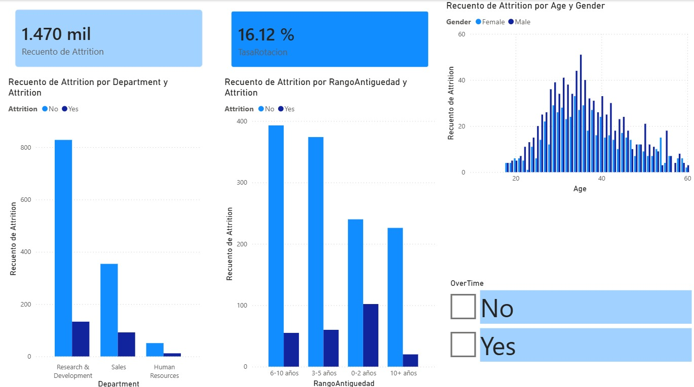

# 📊 HR Analytics — Predicción de Rotación de Personal

Proyecto end-to-end de análisis de datos y machine learning para predecir la rotación (attrition) de empleados, usando el dataset IBM HR Analytics.

## Objetivo

Identificar los principales factores asociados a la renuncia de empleados y construir un modelo predictivo que ayude a Recursos Humanos a anticipar el riesgo de rotación.

## Estructura del proyecto
```text
hr-analytics-attrition/
│
├── data/
│   ├── raw/                  # Dataset original (IBM HR Analytics, 1470 filas)
│   └── processed/            # Dataset procesado, listo para modelado
│
├── notebooks/
│   ├── 01_eda.ipynb                  # Análisis exploratorio de datos
│   ├── 02_feature_engineering.ipynb  # Limpieza y transformación de variables
│   └── 03_model.ipynb                # Modelo Random Forest y evaluación
│
├── requirements.txt
└── README.md
```

## Hallazgos principales (EDA)

- Solo el **16.1%** de los empleados presenta Attrition = Yes (dataset desbalanceado).
- **OverTime** es un fuerte predictor: la proporción de renuncia es notablemente mayor entre quienes hacen horas extra.
- A menor **JobSatisfaction**, mayor probabilidad de renuncia.
- Los empleados que renuncian tienden a ser más jóvenes, con menor salario, mayor distancia al trabajo y menor antigüedad (<5 años).

## Feature Engineering

- Eliminación de columnas sin valor predictivo (`EmployeeCount`, `Over18`, `StandardHours`, `EmployeeNumber`).
- Encoding binario para variables de 2 categorías (`Attrition`, `OverTime`, `Gender`).
- One-Hot Encoding para variables categóricas múltiples (`Department`, `JobRole`, `MaritalStatus`, etc.).

## Modelo

- **Algoritmo:** Random Forest Classifier
- **Manejo de desbalance:** SMOTE (oversampling de la clase minoritaria)
- **Ajuste de umbral:** se redujo el umbral de decisión de 0.5 a 0.35 para priorizar recall

## Dashboard



### Métricas finales

| Métrica | Valor |
|---|---|
| Accuracy | 78.6% |
| Recall | 61.7% |
| Precision | 39.2% |
| F1-Score | 47.9% |

> Se priorizó **recall sobre accuracy**: en un problema de retención de talento, es más costoso no detectar a un empleado en riesgo que generar falsas alarmas.

## Tecnologías

- Python (Pandas, NumPy, Scikit-learn, Imbalanced-learn)
- Matplotlib, Seaborn
- Jupyter Notebook

## Cómo ejecutar

```bash
git clone https://github.com/AldhaValenzuelaH/hr-analytics-attrition.git
cd hr-analytics-attrition
python -m venv venv
venv\Scripts\activate
pip install -r requirements.txt
```

## 👤 Autor

**Aldhair Valenzuela Huillcaya**
[LinkedIn](#) | [GitHub](https://github.com/AldhaValenzuelaH)
